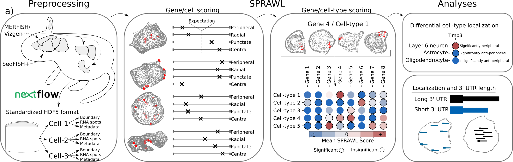
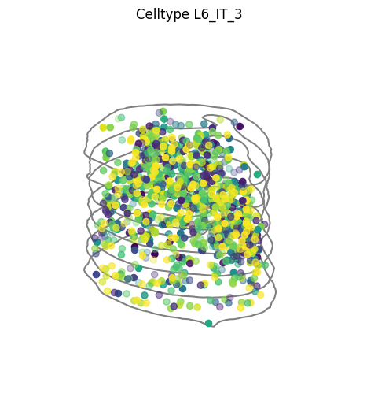

<!-- [](https://codecov.io/gh/r-bierman/SRRS) -->

## SPRAWL: Subcellular Patterning Ranked Analysis With Labels



SPRAWL is a tool to identify subcellular RNA localization patterning from highly multiplexed spatial transcriptomics techniques such as MERFISH/Vizgen and SeqFish+

### Manuscript
The SPRAWL methodology is introduced in ???

### Installation
SPRAWL is available on PyPI as:

```
pip install subcellular-sprawl
```

### Getting started
The following can be used to test that sprawl has been installed correctly
```
from sprawl import vignette,plotting
import matplotlib.pyplot as plt

#load MERFISH sample data from included vignette
sample = vignette.m1s4_hdf5()
cells = sample.cells()

#plot the first cell with each gene in a different color 
cell = cells[0]

fig,ax = plotting.plot_cell_3D(cell, rainbow=True)
ax.get_legend().remove() #legend is busy with 129 genes!
plt.show()
#plt.savefig('example_cell.png') #can save instead of show
plt.close()
```




There are more examples in the `vignettes/` subdir

### Repository Organization
```
├── analysis
│   └── [jupyter notebooks for major analyses in paper]
├── Dockerfile
├── imgs
│   └── [images for README]
├── nf_pipeline
│   └── [nextflow singularity pipeline for running SPRAWL]
├── package
│   └── [SPRAWL python package with src/ and build/]
├── paper
│   └── [figures and text for sprawl paper]
├── preprocessing
│   └── [preprocessing nextflow scripts for spatial datasets]
├── README.md
│   └── [this file]
├── requirements_test.txt
│   └── [requirements for running pytest]
├── tests
│   └── [non-comprehensive unittests for sprawl]
└── vignettes
    └── [jupyter notebooks showing how to use included package data]
```

### Dependencies
The SPRAWL python package requires python version 3.6.1 or above and depends on the following packages which are automatically installed along with SPRAWL
*    numpy >= 1.19
*    pandas >= 1.1
*    scipy >= 1.5
*    statsmodels >= 0.12
*    shapely >= 1.8
*    matplotlib >= 3.3
*    seaborn >= 0.11
*    h5py >= 2.10
*    importlib_resources >= 5.4
*    click >= 8.0
*    pysam >= 0.19

